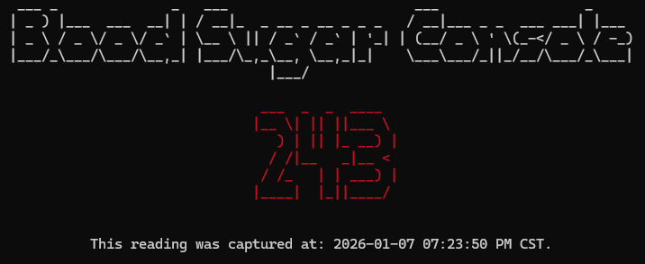

# Blood Sugar Console 🩸


A simple python-based console application that fetches and displays blood sugar readings from the unoffical LibreView API using a custom `LibreViewAPI` Python class.



## 📋 Prerequisites

- [LibreLinkUp](https://www.librelinkup.com/)
- [Python 3.8+](https://www.python.org/downloads/)

## ⚡ Quickstart Guide

### 1. Clone the Repository

```bash
git clone https://github.com/malwaredetective/blood-sugar-console.git
cd lood-sugar-console
```

### 2. Set Up a Python Virtual Environment

```bash
python3 -m venv venv
source venv/bin/activate    # (Windows: venv\Scripts\activate)
```
### 3. Install Python Dependencies

```bash
pip install -r requirements.txt
```

### 4. Create a local .env file to store your 
Create a `.env` file within the root of the project and add your LibreView credentials:

```bash
LIBRE_FREESYTLE_EMAIL=your_email@example.com
LIBRE_FREESYTLE_PASSWORD=your_password_here
```

### 5. Execute the Script within your Terminal

```bash
python blood-sugar-console.py
```

## 🙏 Acknowledgements

This project uses reverse-engineered LibreView API endpoints documented by the community at [https://libreview-unofficial.stoplight.io/](https://libreview-unofficial.stoplight.io/). Thanks to the maintainers and contributors for making this valuable resource available!
